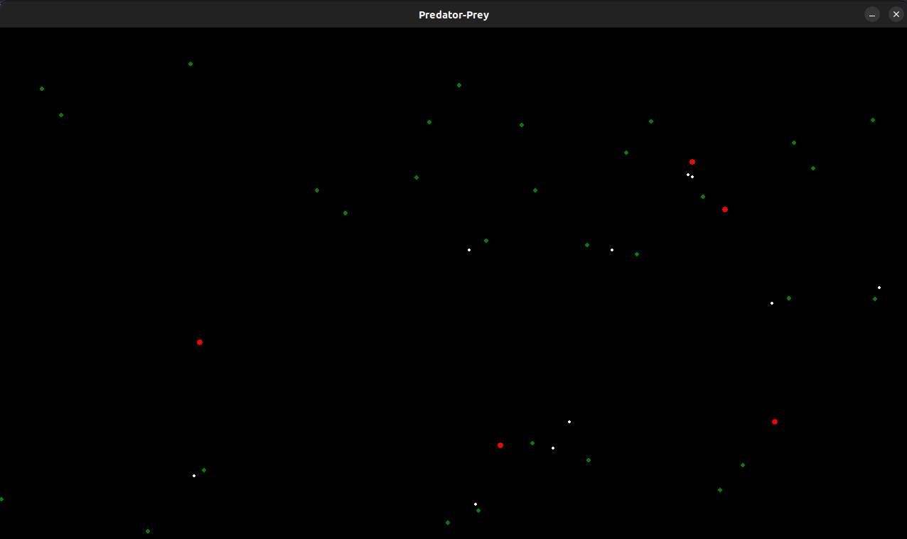

# PredatorPreySMA

The program simulates a simplified ecosystem of predators, prey and plants inspired by this [article](https://medium.com/@ulriktpedersen/creating-a-simple-predator-prey-model-with-mesa-a-python-simulation-library-4835f29791ae). It uses the [Mesa library](https://mesa.readthedocs.io/en/stable/) for agent modeling and Pygame for visual rendering of the simulation. Here is a brief description of the program's main components and features:

- Agent Classes: The program defines three main agent classes: Predator, Prey and Plant. Each of these classes represents a type of entity in the simulated ecosystem, with specific behaviors to interact with the environment and other agents.
- Simulation Model: The PredatorPreyModel class is responsible for creating and managing the simulation as a whole. It instantiates a specific number of predators, prey, and plants, adding them to the environment and controlling their interaction over time.
- Main Loop: The program's main loop controls the progression of the simulation, updating the state of the agents at each time step and rendering the changes on the screen. The program continues running until the user decides to close the window.
- Interconnection between Agents: Predators hunt prey, prey seek food from plants, and plants grow and reproduce. These interactions are modeled to simulate a basic life cycle within the ecosystem.

In short, the program provides an interactive visualization of a simplified ecosystem, where different types of agents interact with each other and with the environment. It offers an intuitive way to observe population dynamics and understand the effects of interactions between predators, prey and resources.

